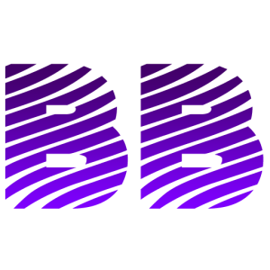

# Hi there 👋. This is [Bishwas Bhandari](https://bishwas.net)

### A keen learner and freelancer enthusiast who loves pythoning the way.

- 🔭 I’m currently working on Python, Selenium, Django.
- 🌱 I’m currently freelancing on Web Automation, scraping and web development.
- 👯 I’m looking to collaborate as moderator in [Webmatrices Forum](https://webmatrices.com/)

### Connect with me:

 

### Tools I am using right now:

 
 
